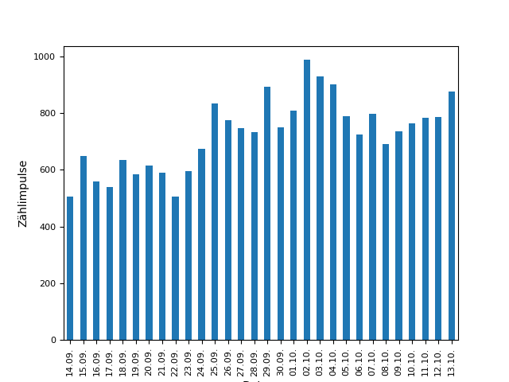

# Gaszähler auslesen und Verbrauchsdaten auf einer Website darstellen

Diese Software besteht aus drei Komponenten:
* zwei Python-Skripten, die auf einem Raspberry Pi ausgeführt werden
* einem Cron-Job, der jede Nacht das Statistik-Skript startet
* Dateien für eine Website, auf der Statistiken dargestellt werden sollen

Das Ergebnis sind Diagramme wie dieses:

# Abläufe
1. Ein Raspberry Pi protokolliert jede Umdrehung des Gaszählers durch den Magnetkontakt mit sekundengenauem Zeitstempel.
1. Jede Nacht werden aus den gesammelten Daten zwei Statistiken erzeugt: Gasverbrauch pro Tag und Gasverbrauch pro Stunde des Tages.
1. Diese Bilder werden auf die Website hochgeladen.
1. Die Inhalte der Website liegen im Ordner web/

# Schritte zur Installation
* Magnetkontakt mit den GPIO-Pins des Raspberry verkabeln
* Verzeichnis web/ auf geeigneter Website hochladen
* interrupt.py und create_report_py auf den Raspberry in ein leeres Verzeichnis kopieren
* pip3 install pandas, matplotlib auf dem Pi ausführen
* interrupt.py 'headless' starten
* Konfigdaten (u.a. FTP-Passwort) in create_report.py eintragen
* cron-Job für Start von create_report.py einrichten

# Verkabelung der Pins auf dem Raspberry Pi 3 B
* Auf eigene Gefahr! Bitte vorher Doku des eigenen Raspberry durchlesen!
* PIN 17 (+3,3 V)
* PIN 18 (GPIO 24)

# Befehle zur Installation auf dem Raspberry Pi:
1. sudo -H pip3 install pandas
1. sudo -H pip3 install matplotlib
1. Wenn das Verzeichnis "dev" heißt:
1. scp interrupt.py pi@ IP-Adresse deines Raspberry Pi :/home/pi/dev/
1. scp create_report.py pi@ IP-Adresse deines Raspberry Pi :/home/pi/dev/
1. Erstellen der Crontab:
1. crontab -e
1. # m h  dom mon dow   command
1. 0 1 * * * cd /home/pi/dev && /usr/bin/python create_report.py >> cronlog.txt 2>&1
1. nohup python interrupt.py &

# Kopieren der Zählerdatei vom Raspberry Pi auf den lokalen Rechner (z.B. als Backup)
scp pi@ IP-Adresse deines Raspberry Pi :/home/pi/dev/zaehler.csv zaehler-lokal.csv

# Knwon issues:
1. Gas nach Stunde Format y-Achse
1. Gas nach Datum gesamt - besser letzte 12 Monate
1. Gas nach Stunde gesamt - besser letzte 12 Monate
1. zuviel logging
1. Gas nach Datum (gesamter Zeitraum): heute wird leider einberechnet (kleiner Balken)

# Quellen
* https://gitlab.server-kampert.de/Kampi/Raspberry-Pi/-/blob/master/Software/GPIO/Interrupt.py
* https://www.elektronik-kompendium.de/sites/raspberry-pi/1907101.htm
* Secure copy http://www.hypexr.org/linux_scp_help.php
